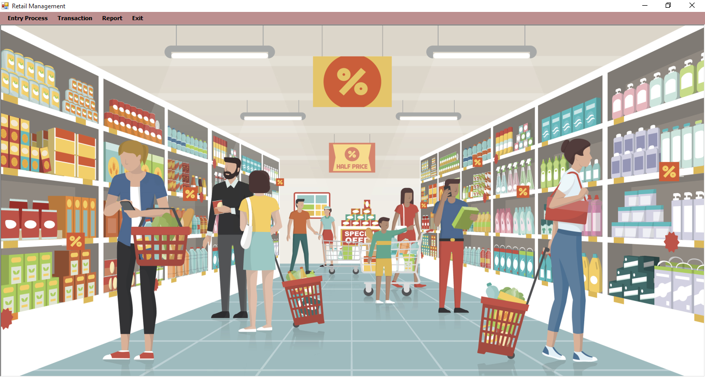
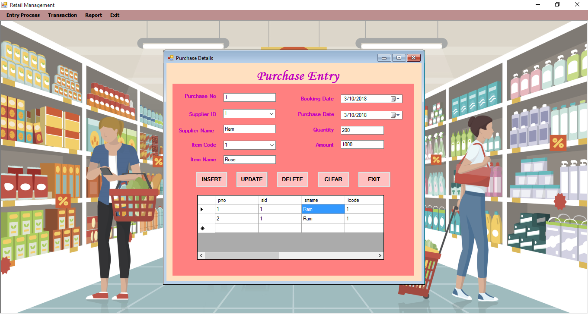
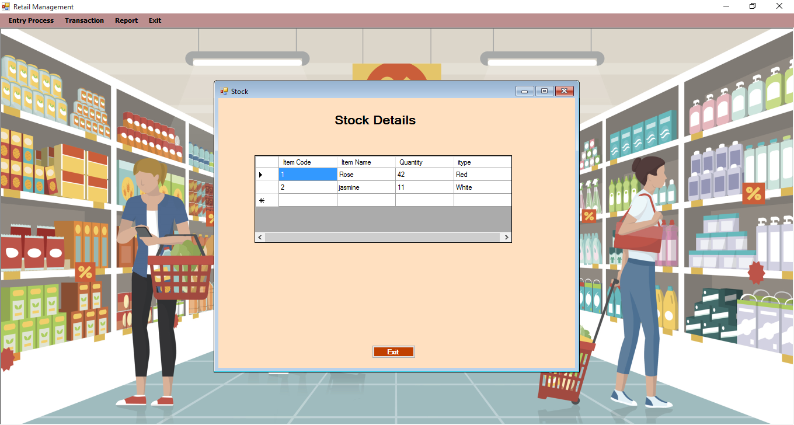

# Retail-management
The project entitled “RETAIL SHOP MANAGEMENT” is developed using VB.NET with the back end MS-ACCESS. The main objective of this project is to provide flexible data handling over handling bulk data processing in a retail shop.

You can also check how the application works :point_right:  (bin/Debug/Retail.exe)

## ScreenShot :camera_flash:

